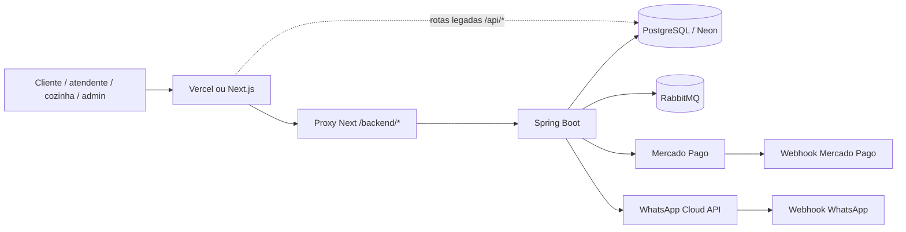
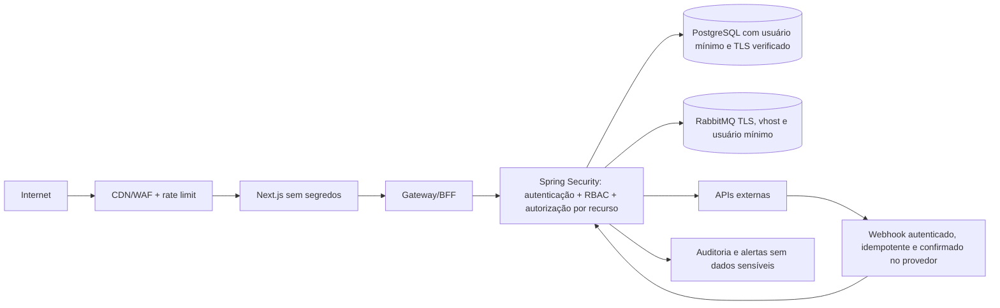

# Mapa de arquitetura e confiança — Menfi's Burger

> Levantamento estático realizado em 24/07/2026. Esta etapa é somente documental: nenhuma proteção foi ativada e nenhuma credencial foi alterada.

## Escopo analisado

- Frontend Next.js/TypeScript em `frontend/`, publicado por Vercel ou contêiner.
- Backend Java 21/Spring Boot em `backend/`, publicado por Railway ou contêiner.
- PostgreSQL/Neon, RabbitMQ, Mercado Pago e WhatsApp Cloud API.
- Fluxos delivery, kiosk/totem, KDS, entrega e administração.
- Dockerfiles, Compose, configurações, migrations e histórico de nomes versionados.

O estado real dos painéis Vercel, Railway, Neon, Mercado Pago, Meta, RabbitMQ e GitHub não pode ser comprovado apenas pelo repositório. Esses itens aparecem como **VERIFICAR EXTERNAMENTE**.

## Arquitetura encontrada

### Fronteiras de confiança

1. **Internet → frontend:** todo conteúdo enviado pelo navegador é não confiável.
2. **Frontend → backend:** o proxy encaminha cabeçalhos; ele não é um ponto de autorização.
3. **Backend → dados:** somente o backend deveria calcular valores e escrever no banco.
4. **Provedores → webhooks:** eventos só podem ser aceitos após autenticação criptográfica e confirmação na API do provedor.
5. **Backend → RabbitMQ:** mensagens precisam de identidade técnica, TLS, idempotência, limite de tamanho e política de falha.
6. **Operação → administração:** painel administrativo, KDS e entrega precisam de identidades e permissões próprias.

## Fluxos atuais

| Fluxo | Caminho observado | Estado |
|---|---|---|
| Cardápio/configuração pública | navegador → Next → Spring | Esperado |
| Pedido principal | navegador → proxy `/backend` → Spring → PostgreSQL | Spring recalcula preços; controle positivo |
| Pedido legado | navegador → rotas Next `/api/orders*` → PostgreSQL | **Crítico: contorna o backend** |
| Sessão | login Spring → JWT → `localStorage` | Funcional, mas sem refresh/revogação |
| KDS | Next → Spring, reutilizando papel administrativo | Permissão ampla demais |
| Entrega | Next → Spring com papel `DELIVERY` | Parcialmente segregado |
| Pagamento | Spring → Mercado Pago; Mercado Pago → webhook Spring | Assinatura implementada, mas falha aberta sem secret |
| WhatsApp | Meta → webhook Spring; Spring → Graph API | Verificação de POST ausente |
| Eventos de pedido | Spring → RabbitMQ → consumidores | ACK manual e DLQ presentes |
| Auditoria | serviços → tabela `audit_logs` | Existe, cobertura e retenção precisam ser ampliadas |

## Identidades encontradas e modelo-alvo

Hoje os tokens distinguem principalmente `CUSTOMER`, `DELIVERY` e `ADMIN`; o KDS usa privilégio administrativo. O alvo é:

| Papel | Permissão mínima |
|---|---|
| `CUSTOMER` | próprio perfil, próprios pedidos e pagamento do próprio pedido |
| `KITCHEN` | fila e mudança de preparo; sem financeiro ou credenciais |
| `ATTENDANT` | balcão e atendimento; sem configuração sensível |
| `DELIVERY` | rota atribuída e confirmação de entrega |
| `MANAGER` | operação, estoque e relatórios permitidos |
| `ADMIN` | configuração e gestão de acessos, com MFA |
| `SYSTEM` | webhooks e tarefas máquina-a-máquina; sem login humano |

## Arquitetura Zero Trust desejada

Princípio obrigatório: não confiar em origem, rede, interface, papel declarado pelo cliente ou valor calculado no navegador. Toda decisão sensível deve ser revalidada no backend.

